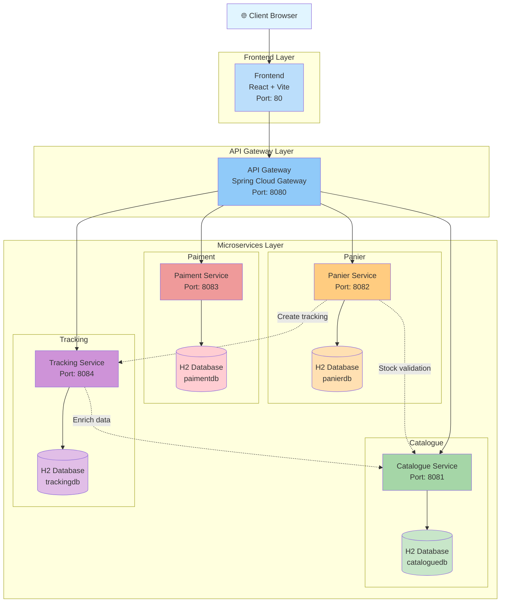

# 🛒 E-Commerce Microservices Architecture

Multi-module Spring Boot project implementing a microservices-based e-commerce system with catalogue, shopping cart, payment processing, order tracking services, API gateway, and frontend application.

📄 **Detailed project documentation**: [PROJECT_DESCRIPTION.md](PROJECT_DESCRIPTION.md)

---

## 📋 Table of Contents

- [Architecture Overview](#architecture-overview)
- [Microservices](#microservices)
- [Prerequisites](#prerequisites)
- [Getting Started](#getting-started)
- [Running the Services](#running-the-services)
- [Testing the APIs](#testing-the-apis)
- [Project Structure](#project-structure)
- [Technologies Used](#technologies-used)
- [Troubleshooting](#troubleshooting)

---

## 🏗️ Architecture Overview

This project follows a **microservices architecture** with an API Gateway pattern where:
- Each backend service runs independently on its own port
- Each service has its own H2 in-memory database
- All services expose REST APIs
- Services communicate via HTTP
- API Gateway routes external requests to appropriate services
- Frontend application consumes the APIs



---

## 🎯 Microservices

### 1. **Gateway Service** (Port: 8080)
API Gateway using Spring Cloud Gateway for routing requests to backend services.

**Routes:**
- `/api/products/**` → Catalogue Service (8081)
- `/cart/**` → Panier Service (8082)
- `/api/payments/**` → Paiment Service (8083)
- `/api/tracking/**` → Tracking Service (8084)

### 2. **Catalogue Service** (Port: 8081)
Manages the product catalogue with full CRUD operations and stock management.

**Endpoints:** `/api/products`
- `GET /api/products` - List all products
- `GET /api/products/{id}` - Get product by ID
- `POST /api/products` - Create product
- `PUT /api/products/{id}` - Update product
- `DELETE /api/products/{id}` - Delete product
- `GET /api/products/check-stock?productId={id}&quantity={qty}` - Check stock availability
- `PUT /api/products/reduce-stock?productId={id}&quantity={qty}` - Reduce stock (used by checkout)
- `PUT /api/products/restore-stock?productId={id}&quantity={qty}` - Restore stock (on cancellation)

### 3. **Panier Service** (Port: 8082)
Order orchestrator that manages cart and coordinates the complete checkout workflow.

**Endpoints:** `/cart`
- `GET /cart` - View cart items
- `POST /cart/add?productId={id}&quantity={qty}` - Add to cart (validates stock)
- `DELETE /cart` - Clear cart
- `POST /cart/checkout` - Complete checkout (creates order, reduces stock, creates tracking)
- `GET /cart/orders` - Get all orders
- `GET /cart/orders/{id}` - Get specific order details

**Integration:** Calls Catalogue (stock validation/reduction) and Tracking (order tracking creation)

### 4. **Paiment Service** (Port: 8083)
Manages payment processing and transaction records.

**Endpoints:** `/api/payments`
- `GET /api/payments` - List all payments
- `GET /api/payments/{id}` - Get payment by ID
- `GET /api/payments/card/{cardNumber}` - Get payment by card number
- `POST /api/payments` - Create payment
- `PUT /api/payments/{id}/process` - Process payment approval
- `DELETE /api/payments/{id}` - Delete payment

### 5. **Tracking Service** (Port: 8084)
Tracks order status and provides enriched tracking data with product details.

**Endpoints:** `/api/tracking`
- `GET /api/tracking` - List all trackings
- `GET /api/tracking/{id}` - Get tracking by ID
- `GET /api/tracking/order/{orderId}` - Get tracking by order ID
- `GET /api/tracking/product/{productId}` - Get trackings by product ID
- `POST /api/tracking` - Create tracking
- `PUT /api/tracking/{id}` - Update tracking status
- `DELETE /api/tracking/{id}` - Delete tracking
- `GET /api/tracking/order/{orderId}/enriched` - Get tracking + product details
- `PUT /api/tracking/order/{orderId}/cancel` - Cancel order

**Integration:** Calls Catalogue to enrich tracking data with product information

📄 **Detailed API documentation:** [tracking-service/ENDPOINTS_TEST.md](tracking-service/ENDPOINTS_TEST.md)

### 6. **Frontend** (Port: 5173)
Web application built with Vite and React for the user interface.

---

## ⚙️ Prerequisites

Before running this project, make sure you have:

- **Java 17** or higher ([Download](https://adoptium.net/))
- **Maven 3.6+** (or use included Maven Wrapper)
- **Node.js 18+** and **npm** (for frontend) ([Download](https://nodejs.org/))
- **Git** (optional, for version control)

To verify your installations:
```bash
java -version
mvn -version
node -version
npm -version
```

---

## 🚀 Getting Started

### Option 1: Running with Docker Compose (Recommended)

This is the **fastest and easiest** way to run the entire application.

**Prerequisites:**
- Docker and Docker Compose installed ([Download Docker Desktop](https://www.docker.com/products/docker-desktop))

**Quick Start with Scripts:**

```bash
# Windows
start.bat

# Linux/Mac
chmod +x start.sh
./start.sh
```

**Manual Steps:**

1. **Clone the repository**
```bash
git clone <repository-url>
cd ArchitectureMicroServices
```

2. **Build all backend services JARs**
```bash
# Windows
mvnw.cmd clean package -DskipTests

# Linux/Mac
./mvnw clean package -DskipTests
```

3. **Start all services with Docker Compose**
```bash
docker-compose up -d
```

This will start:
- Gateway Service (port 8080)
- Catalogue Service (port 8081)
- Panier Service (port 8082)
- Paiment Service (port 8083)
- Tracking Service (port 8084)
- Frontend (port 80)

4. **Verify services are running**
```bash
docker-compose ps
```

5. **Access the application**
- Frontend: http://localhost
- API Gateway: http://localhost:8080
- Direct service access: ports 8081-8084

6. **View logs**
```bash
# All services
docker-compose logs -f

# Specific service
docker-compose logs -f catalogue
```

7. **Stop all services**
```bash
docker-compose down
```

---

### Option 2: Manual Installation (Development)

For development or if you prefer running services individually.

#### Prerequisites

- **Java 17** or higher ([Download](https://adoptium.net/))
- **Maven 3.6+** (or use included Maven Wrapper)
- **Node.js 18+** and **npm** (for frontend) ([Download](https://nodejs.org/))

To verify:
```bash
java -version
mvn -version
node -version
npm -version
```

#### Steps

### 1. Clone the repository
```bash
git clone <repository-url>
cd ArchitectureMicroServices
```

### 2. Clean and build the entire project

**⚠️ IMPORTANT:** After cloning or merging branches, always run a clean build to avoid dependency and compilation issues:

**On Windows (PowerShell/CMD):**
```bash
mvnw.cmd clean install
```

**On Linux/Mac:**
```bash
./mvnw clean install
```

**If you encounter build issues:**
```bash
# Force update all dependencies
mvnw.cmd clean install -U

# Skip tests if they're failing
mvnw.cmd clean install -DskipTests
```

This will:
- Clean previous build artifacts
- Download all dependencies
- Compile all backend services
- Run tests (if any)
- Package each service as a JAR file

### 3. Install frontend dependencies

```bash
cd frontend
npm install
cd ..
```

---

## 🏃 Running the Services

### Backend Services

Each service runs independently. Recommended startup order:

**Terminal 1 - Gateway Service (Start FIRST):**
```bash
cd gateway-service
java -jar target/gateway-service-0.0.1-SNAPSHOT.jar
```
✅ Gateway running on: http://localhost:8080

**Terminal 2 - Catalogue Service:**
```bash
cd catalogue-service
java -jar target/catalogue-service-0.0.1-SNAPSHOT.jar
```
✅ Service running on: http://localhost:8081

**Terminal 3 - Paiment Service:**
```bash
cd paiment-service
java -jar target/paiment-service-0.0.1-SNAPSHOT.jar
```
✅ Service running on: http://localhost:8083

**Terminal 4 - Panier Service:**
```bash
cd panier-service
java -jar target/panier-service-0.0.1-SNAPSHOT.jar
```
✅ Service running on: http://localhost:8082

**Terminal 5 - Tracking Service:**
```bash
cd tracking-service
java -jar target/tracking-service-0.0.1-SNAPSHOT.jar
```
✅ Service running on: http://localhost:8084

**Terminal 6 - Frontend (Start LAST):**
```bash
cd frontend
npm run dev
```
✅ Frontend running on: http://localhost:5173

### Once all services are running, test them:

```bash
# Test Gateway Service
curl http://localhost:8080

# Test Catalogue Service (direct)
curl http://localhost:8081/api/products

# Test Catalogue Service (via Gateway)
curl http://localhost:8080/api/products

# Test Panier Service (direct)
curl http://localhost:8082/cart

# Test Panier Service (via Gateway)
curl http://localhost:8080/cart

# Test Paiment Service (direct)
curl http://localhost:8083/api/payments

# Test Paiment Service (via Gateway)
curl http://localhost:8080/api/payments

# Test Tracking Service (direct)
curl http://localhost:8084/api/tracking

# Test Tracking Service (via Gateway)
curl http://localhost:8080/api/tracking
```

### Access Points

| Service | Direct URL | Via Gateway | Frontend |
|---------|-----------|-------------|----------|
| Gateway | - | http://localhost:8080 | - |
| Catalogue | http://localhost:8081/api/products | http://localhost:8080/api/products | - |
| Panier | http://localhost:8082/cart | http://localhost:8080/cart | - |
| Paiment | http://localhost:8083/api/payments | http://localhost:8080/api/payments | - |
| Tracking | http://localhost:8084/api/tracking | http://localhost:8080/api/tracking | - |
| Frontend | - | - | http://localhost:5173 |

---

## 🐳 Running with Docker Compose

See [Option 1 in Getting Started](#option-1-running-with-docker-compose-recommended) for Docker Compose instructions.

---

## 🧪 Test Scenarios

### Scenario 1: Complete Purchase Flow

```bash
# 1. View available products
curl http://localhost:8080/api/products

# 2. Add product to cart (replace productId with actual ID)
curl -X POST "http://localhost:8080/cart/add?productId=1&quantity=2"

# 3. View cart
curl http://localhost:8080/cart

# 4. Checkout (replace with actual customer data)
curl -X POST http://localhost:8080/cart/checkout \
  -H "Content-Type: application/json" \
  -d '{
    "customerName": "John Doe",
    "customerEmail": "john@example.com",
    "shippingAddress": "123 Main St, City"
  }'

# 5. Track order (replace orderId with the one from checkout response)
curl http://localhost:8080/api/tracking/order/{orderId}/enriched
```

### Scenario 2: Payment Processing

```bash
# 1. Create payment
curl -X POST http://localhost:8080/api/payments \
  -H "Content-Type: application/json" \
  -d '{
    "cardNumber": "4532123456789012",
    "amount": 99.99,
    "approved": false
  }'

# 2. Process payment (replace {id} with payment ID)
curl -X PUT http://localhost:8080/api/payments/{id}/process

# 3. View payment status
curl http://localhost:8080/api/payments/{id}
```

### H2 Database Consoles

Each backend service has its own in-memory H2 database accessible via web console:

**Catalogue Service:**
- URL: http://localhost:8081/h2-console
- JDBC URL: `jdbc:h2:mem:cataloguedb`
- Username: `sa`
- Password: *(empty)*

**Panier Service:**
- URL: http://localhost:8082/h2-console
- JDBC URL: `jdbc:h2:mem:panierdb`
- Username: `sa`
- Password: *(empty)*

**Paiment Service:**
- URL: http://localhost:8083/h2-console
- JDBC URL: `jdbc:h2:mem:paimentdb`
- Username: `sa`
- Password: *(empty)*

**Tracking Service:**
- URL: http://localhost:8084/h2-console
- JDBC URL: `jdbc:h2:mem:trackingdb`
- Username: `sa`
- Password: *(empty)*

---

## 📁 Project Structure

```
ArchitectureMicroServices/
│
├── pom.xml                          # Parent POM
├── docker-compose.yml               # Docker Compose configuration
├── README.md                        # This file
├── INTEGRATION_SUMMARY.md           # Integration details
├── TESTING_GUIDE.md                 # Testing documentation
│
├── gateway-service/                 # API Gateway (Spring Cloud Gateway)
│   ├── pom.xml
│   └── src/
│       └── main/java/com/example/gatewayservice/
│           └── GatewayServiceApplication.java
│
├── catalogue-service/               # Product catalogue microservice
│   ├── Dockerfile
│   ├── pom.xml
│   └── src/
│       ├── main/java/com/example/catalogue/
│       │   ├── CatalogueApplication.java
│       │   ├── controller/ProductController.java
│       │   ├── entity/Product.java
│       │   ├── repository/ProductRepository.java
│       │   └── service/ProductService.java
│       └── resources/application.properties
│
├── panier-service/                  # Shopping cart microservice
│   ├── Dockerfile
│   ├── pom.xml
│   └── src/
│       ├── main/java/com/example/panier/
│       │   ├── PanierApplication.java
│       │   ├── controller/CartController.java
│       │   ├── entity/CartItem.java
│       │   ├── repository/CartItemRepository.java
│       │   └── service/CartService.java
│       └── resources/application.properties
│
├── paiment-service/                 # Payment processing microservice
│   ├── Dockerfile
│   ├── pom.xml
│   └── src/
│       ├── main/java/com/example/paiment_service/
│       │   ├── PaimentServiceApplication.java
│       │   ├── controller/PaimentItemController.java
│       │   ├── entity/PaimentItem.java
│       │   ├── repository/PaimentItemRepository.java
│       │   └── service/PaimentItemService.java
│       └── resources/application.yaml
│
├── tracking-service/                # Order tracking microservice
│   ├── Dockerfile
│   ├── pom.xml
│   ├── ENDPOINTS_TEST.md            # API documentation
│   └── src/
│       ├── main/java/com/example/tracking/
│       │   ├── TrackingApplication.java
│       │   ├── controller/TrackingController.java
│       │   ├── entity/TrackingInfo.java
│       │   ├── repository/TrackingRepository.java
│       │   └── service/TrackingService.java
│       └── resources/application.properties
│
└── frontend/                        # Frontend application (React)
    ├── package.json
    ├── vite.config.ts
    ├── Dockerfile
    ├── src/
    └── public/
```

---## 🛠️ Technologies Used

### Backend
| Technology | Version | Purpose |
|------------|---------|---------|
| **Java** | 17 | Programming language |
| **Spring Boot** | 3.4.1 | Application framework |
| **Spring Cloud Gateway** | 2024.0.0 | API Gateway |
| **Spring Data JPA** | 3.4.1 | Database access layer |
| **Spring Web** | 3.4.1 | REST API creation |
| **H2 Database** | Runtime | In-memory database |
| **Hibernate** | 6.6.4 | ORM (Object-Relational Mapping) |
| **Maven** | 3.x | Build tool & dependency management |
| **Docker** | Latest | Containerization |

### Frontend
| Technology | Purpose |
|------------|---------|
| **Vite** | Build tool and dev server |
| **React** | Frontend framework |
| **TypeScript** | Type-safe JavaScript |
| **Tailwind CSS** | Utility-first CSS framework |
| **Node.js** | JavaScript runtime |

---

## 🔧 Troubleshooting

### After Git Merge - Build Issues

**Problem:** After merging branches, you get compilation errors or dependency issues.

**Solution:** Always clean and rebuild:
```bash
# Windows
mvnw.cmd clean install -U

# Linux/Mac
./mvnw clean install -U
```

The `-U` flag forces Maven to update all dependencies.

### Port already in use
If you get an error like "Port 8081 is already in use":

**Windows:**
```bash
# Find process using the port
netstat -ano | findstr :8081

# Kill the process (replace PID)
taskkill /PID <process-id> /F
```

**Linux/Mac:**
```bash
# Find and kill process
lsof -ti:8081 | xargs kill -9
```

Or change the port in `application.properties`:
```properties
server.port=8084
```

### Build failures
If the build fails:
```bash
# Clean everything and rebuild
mvnw.cmd clean install -U

# Skip tests if they're failing
mvnw.cmd clean install -DskipTests

# Build specific module only
cd catalogue-service
mvn clean install
```

### Maven dependency conflicts
```bash
# Clear Maven cache
rm -rf ~/.m2/repository  # Linux/Mac
rmdir /s %USERPROFILE%\.m2\repository  # Windows

# Rebuild
mvnw.cmd clean install
```

### IDE not recognizing classes
If your IDE shows errors but the build works:

**VS Code:**
1. Press `F1` → "Java: Clean Java Language Server Workspace"
2. Select "Restart and delete"
3. Reload window

**IntelliJ IDEA:**
1. File → Invalidate Caches
2. Right-click `pom.xml` → Maven → Reload Project

### Frontend won't start
```bash
cd frontend
rm -rf node_modules package-lock.json
npm install
npm run dev
```

### Gateway can't reach services
Make sure all backend services are running BEFORE starting the gateway.

**Check services are up:**
```bash
curl http://localhost:8081/api/products
curl http://localhost:8082/cart
curl http://localhost:8083/api/payments
curl http://localhost:8084/api/tracking
```

---

## 📚 Additional Resources

- [Spring Boot Documentation](https://docs.spring.io/spring-boot/docs/current/reference/html/)
- [Spring Data JPA Guide](https://spring.io/guides/gs/accessing-data-jpa/)
- [Spring Cloud Gateway](https://spring.io/projects/spring-cloud-gateway)
- [Docker Documentation](https://docs.docker.com/)
- [REST API Best Practices](https://restfulapi.net/)

---

## 👥 Contributors

- Sebastian Ruiz
- Jose Villa
- Javier Vargas

---

## 📝 License

This project is for educational purposes as part of IMT Nord Europe coursework.
